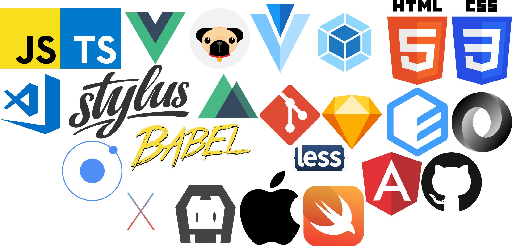
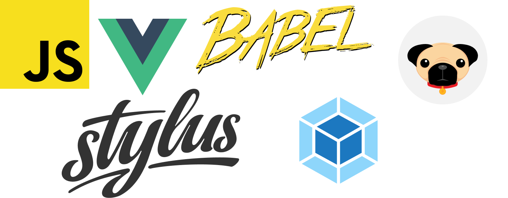

## Content
- [About](#about)
- [Work Experience](#work-experience)
  - [Navicon](#navicon)
  - [Intelligent Product and System](#intelligent-product-and-system)
  - [ARQ](#arq)
  - [Freelance](#freelance)
- [WEB Development](#web-development)
  - [API Tello](#api-trello)
  - [SVG](#svg)
  - [Free time](#free-time-web)
- [IOS Development](#ios-development)
  - [Autolayout](#autolayout)
  - [API](#api)
  - [AR](#ar)
  - [Playground](#playground)
  - [Core Data](#core-data)
  - [Coordinator](#coordinator)
  - [Free time IOS](#free-time-ios)
- [IOS Template](#ios-template)
  - [MVVM](#mvvm)
  - [OAuth2](#oauth2)
  - [VIPER](https://github.com/taijased/swift-VIPER-module)
- [University](#niversity)
  - [Java](#java)
- [Test Task](#test-task) 
- [Posts](#posts)
  - [Bachelor's degree](https://kpfu.ru/student_diplom/192.168.5.202_7780_4858840_VKR_Spiridonov_M.V..pdf)
  - [Используя API Trello и Vue, создаем карточку на доске Trello](https://medium.com/@taijased/%D0%B8%D1%81%D0%BF%D0%BE%D0%BB%D1%8C%D0%B7%D1%83%D1%8F-api-trello-%D0%B8-vue-%D1%81%D0%BE%D0%B7%D0%B4%D0%B0%D0%B5%D0%BC-%D0%BA%D0%B0%D1%80%D1%82%D0%BE%D1%87%D0%BA%D1%83-%D0%BD%D0%B0-%D0%B4%D0%BE%D1%81%D0%BA%D0%B5-trello-2c353cde300d)

## About

  Hello dears! My name is Maxim I am Front-end and IOS developer. Since the first time I saw on the screen "Hello world!"I realized that this is what I want to devote myself to! Since then has flowed away a lot of lines of code.

My main responsibilities in frontend development: 
* project development (frontend part) from scratch;
* revision of existing projects;
* development of business logic and back-end system for product support;
* user interface design;
* the creation of a functional API (joint work with front-end developers);
* cross-browser and adaptive HTML5/CSS3 layout.
  
My main responsibilities in ios development:
* development of mobile applications for iOS;
* mobile application support;
* participation in debugging and testing applications;
* placing apps in the AppStore;
* development of instructions for working with the finished product.
    

Аt this stage of my life my main task and goal is to reach the top in IOS development.To do this, I always learn new technologies and thereby improve my skills and knowledge. And of course, a little about personal qualities:
* commitment;
* perseverance;
* liability;
* sociability;
* the ability to work in a team;
* attention to detail.

# Work Experience

## Navicon 

**Junior developer (.NET)**  March 2017 — April 2017 (2 months)

**City:** Kazan

Participation in MS Dynamics CRM commercial projects as a developer: Participation in the design and development of information systems architecture; Development of functional extensions for MS Dynamics CRM; Web application development;
Form customization; Testing modules; System setup; Carrying out pilot operation of the system.

Apply the skills
* C#
* .NET
* JavaScript

## Intelligent Product and System

**Web Developer**  August 2018 — March 2019 (8 months)

**City:** Kazan

Design and implement user interfaces for websites and mobile applications. Adapt interfaces to viewing on devices with different screen sizes and resolutions. Create cross-platform applications with Cordova. Support site.

Apply the skills
* JavaScript
* Vue.js 
* Webpack
* Ionic Framework 
* Apache cordova 
* Angular

### Projects

* [Application KZNLIVE](https://play.google.com/store/apps/details?id=ru.kznlive)
* [Application Мой бухгалтер](https://play.google.com/store/apps/details?id=ru.nknalog.myBooker)
* [live-press.ru](https://live-press.ru/)
* [m.live-press.ru](https://m.live-press.ru/home)
* [nknalog.ru](https://nknalog.ru/)
* [ips-dev.com](https://ips-dev.com/)
* [dig-city.ru](https://dig-city.ru/)
* [24slide.ru](https://24slide.ru/)
* [ontravel.ips-dev.com](http://ontravel.ips-dev.com)
* [Расчитай НДС](https://xn--80aamogyqjafg2d.xn--p1ai/)

## ARQ

**Web Developer | IOS Developer (Middle)**  October 2018 — Present (7 months)

Apply the skills
* Swift
* Vue.js 

### Projects

* [Valentine Day](https://love.tim.agency/) Just to fun. Link to the repository [here](https://github.com/taijased/valentine-day)
* [Tim Agency](https://tim.agency/) (Site in progress) link to the repository [here](https://github.com/taijased/cup-tim.agency)
* [ARQ](https://arq.su/) link to the repository [here](https://github.com/taijased/arq-spa)
* [ARI](https://ari.house/) (Site in progress) link to the repository [here](https://github.com/taijased/ari-temp)

## Freelance

**Web Developer | IOS Developer**

Apply the skills
* Swift
* Vue.js 

### Projects

* [Bookmarklet Parser](https://github.com/taijased/parser-bookmarklet-js) Parser bookmarklet JavaScript
* [Service Medical](https://github.com/taijased/service-medical) Service project for medical professionals
* [Elementary Math](https://github.com/taijased/elementary-math) IOS Application
* [Tattelecom](https://github.com/taijased/letai-spa) Tattelecom letai
* [Agroshop](https://github.com/taijased/agroshop2017) Old projects agroshop

# WEB Development

## API Tello
* [API Trello](https://github.com/taijased/element-ui-validation-form) Form used API Trello

## SVG
* [Map Russia](https://vue-map-russia.firebaseapp.com/) Using SVG map. Link to the repository [here](https://github.com/taijased/vue-map-russia)

## Free time Web

* [taijased](https://taijased.info/) (Site in progress) portfilio. Link to the repository [here](https://github.com/taijased/taijased-info)
* [revealyan](https://revealyan.info/) (Site in progress) portfilio. Link to the repository [here](https://github.com/taijased/revealyan-card)
* [Agrotools](http://agrotools.store/) Site for brother.(Site in progress) Link to the repository [here](https://github.com/taijased/agrotools-spa)
* [Fill DataSet for AI](http://mmwro.revealyan.info/) Dataset to determine the bolts. Link to the repository [here](https://github.com/taijased/fill-dataset-for-ai) 

# IOS Development

## Autolayout
* [NSLayoutConstraint programmatically](https://github.com/taijased/autolayout-example) Autolayout example with NSLayoutConstraint.

## API

* [Download and Unzip](https://github.com/taijased/download-and-unzip)

## AR

* [Unistroy](https://github.com/taijased/demo-unistroy) Need to fix the display

## Playground

* [Base Swift](https://github.com/taijased/base-playground-swift)
* [Example Patterns](https://github.com/taijased/swift-pattern)

## Core Data
* [ToDo](https://github.com/taijased/todo-coredata)

## Coordinator
* [MVVM Coordinator](https://github.com/taijased/MVVM-Coordinator)
* [Swift Coordinator](https://github.com/taijased/swift-Coordinator)

## Free time IOS

* [Feed Recipe](https://github.com/taijased/FeedRecipe)
* [Creative Workshop](https://github.com/taijased/creative-workshop)

# IOS Template

## MVVM
  * [Table MVVM](https://github.com/taijased/table-MVVM-template)
  * [MVVM Coordinator](https://github.com/taijased/MVVM-Coordinator-template)
  * [Search Repository](https://github.com/taijased/repository-search)
  
  
## OAuth2
* [Facebook and Google](https://github.com/taijased/swift-OAuth2-template) (in progress) OAuth2 template

# Test Task

* [Intelligent Products & System](https://vue-test-intelligent.firebaseapp.com/) Link to the repository [here](https://github.com/taijased/test-project-intelligent)
* [I-Novus](https://github.com/taijased/TestProject_i-novus) Junior frontend. Company i-novis.ru
* [Flexbox Cats](https://github.com/taijased/flexboxKOTE)

# University

## Java
* [Univers Cours 2](https://github.com/taijased/univers_cours2_Java) Java.Eclipse. Old projects from the University. 
